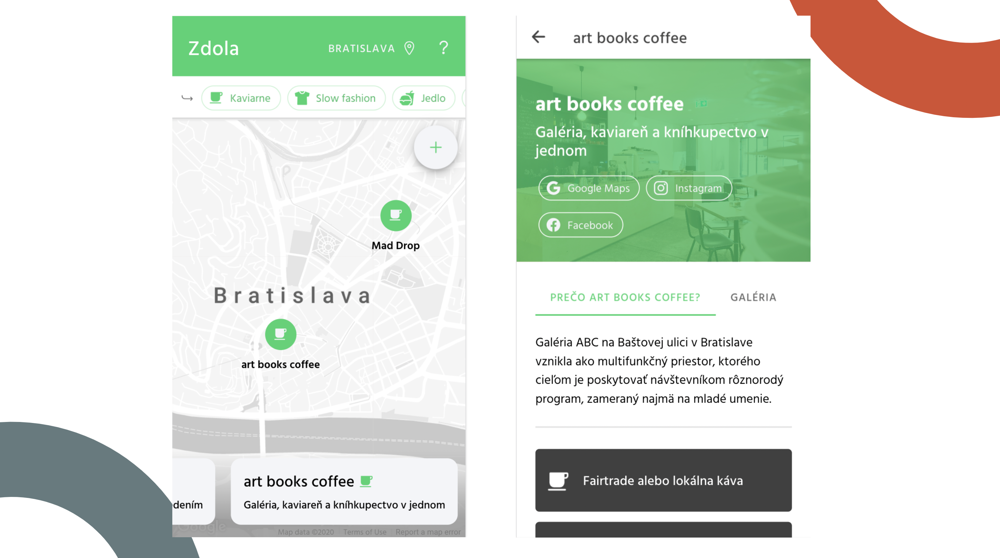

# Backpay

The frontend for a simple web-based community map. The associated backend is at `contrastful/backpay-backend`.

## Features

- Onboarding slideshow
- Filter locations on map by category
- Show location details: Cover image, bio, picture gallery, perks
- Switch between different map areas with their own pins

## Demo (previously ran as a map of sustainable businesses in Bratislava, Slovakia):

- React + Ionic
- Google Maps API

## Todo

- Location suggestion screen
- As a very simple app purpose-built for one city, this repo lacks documentation, language generalization, and isn't backend-agnostic. I'd love to make this a tool that can be implemented for any community map!